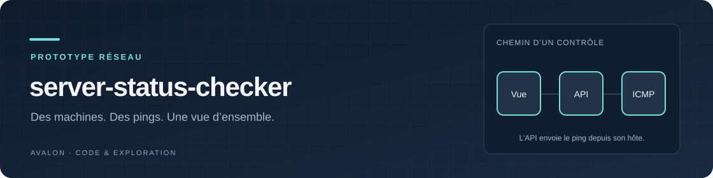

<div align="center">



# server-status-checker

**Un inventaire YAML et une vue d’ensemble des machines qui répondent au ping.**

Un prototype Vue et Node.js pour explorer la joignabilité réseau,
la recherche par machine et l’actualisation périodique.

[](src/components/ServerStatus.vue)
[](server.js)
[](servers.yaml)
[](#portée-et-limites)

[Fonctions](#en-bref) · [Essai local](#essayer-en-développement) · [Architecture](#dans-le-dépôt) · [Limites](#portée-et-limites)

</div>

Les exemples d’utilisation ci-dessous s’adressent aux personnes disposant des
autorisations nécessaires. [Droits et conditions de réutilisation](RIGHTS.md).

> [!WARNING]
> À réserver à un environnement de test isolé : l’API utilise une commande
> shell avec une entrée non validée et ne dispose pas d’authentification.
> Le [périmètre actuel](#portée-et-limites) doit être revu avant toute exposition.

## En bref

| Fonction | Comportement |
|---|---|
| **Inventaire** | noms et adresses des serveurs dans `servers.yaml` |
| **Contrôle** | un ping ICMP par serveur, exécuté par le backend |
| **Actualisation** | lancement d'une vérification toutes les 30 secondes |
| **Recherche** | filtrage des cartes par nom ou adresse IP |
| **Vue d'ensemble** | compteurs en ligne et hors ligne sur tout l’inventaire |
| **Interface** | cartes, indicateurs colorés et mise en page adaptée à la largeur de l'écran |

Le statut correspond à la réponse au ping. Il ne mesure pas la santé d'une
application ou la disponibilité d'un service HTTP.

## Essayer en développement

Le projet utilise Node.js, npm et la commande Unix `ping -c 1`. Le backend
écoute sur le port 3000 sans se limiter explicitement à l’adresse de bouclage :
utilisez une machine de test isolée, conformément à la limite indiquée plus haut.

```bash
git clone https://github.com/AdrienAvalon/server-status-checker.git
cd server-status-checker
npm ci
```

Remplacez l'inventaire d'exemple de [`servers.yaml`](servers.yaml) par des
machines que vous administrez. Le format attendu est :

```yaml
servers:
  - name: Poste local
    ip: 127.0.0.1
  - name: Serveur de test
    ip: 192.0.2.10
```

`192.0.2.10` est une adresse d'exemple à remplacer. Lancez ensuite les deux
composants dans deux terminaux, depuis la racine du dépôt :

```bash
# Terminal 1 : API de ping
node server.js
```

```bash
# Terminal 2 : interface Vue
npm run serve
```

Ouvrez l'adresse indiquée par Vue CLI depuis **le même poste que le backend** :
l'interface appelle actuellement `http://localhost:3000`. Le serveur de
développement fournit `/servers.yaml` grâce à
[`vue.config.js`](vue.config.js).

## Dans le dépôt

| Fichier | Rôle |
|---|---|
| [`src/components/ServerStatus.vue`](src/components/ServerStatus.vue) | chargement de l'inventaire, recherche, contrôles et affichage |
| [`server.js`](server.js) | route `GET /ping?ip=…`, lancement de `ping`, réponse JSON |
| [`servers.yaml`](servers.yaml) | liste des machines |
| [`vue.config.js`](vue.config.js) | publication de l'inventaire en développement |
| [`package.json`](package.json) | dépendances et commandes npm |

Les commandes prévues par le projet sont `npm run serve`, `npm run build`
et `npm run lint`. Cette dernière peut corriger les fichiers. La construction
produit l'interface dans `dist/` ; elle ne déploie pas l'API et ne copie pas
l'inventaire racine dans ce dossier.

## Portée et limites

Cette version est un prototype de tableau de bord. Avant un déploiement
partagé, le backend doit notamment remplacer l'appel shell et valider ses
entrées, puis définir ses contrôles d'accès.

- Les pings sont lancés successivement. Un serveur lent peut retarder la
  passe ; aucune limite de durée globale ni protection contre le
  chevauchement des passes n'est définie.
- Une erreur d'API et un serveur qui ne répond pas sont tous deux affichés
  « Hors ligne ». Un pare-feu qui bloque ICMP peut donc donner le même résultat.
- L'heure « Dernière vérification » est calculée à l'affichage ; aucun
  historique de résultats n'est enregistré.
- L'adresse du backend est codée en dur et la publication de `servers.yaml`
  est configurée pour le développement uniquement.

## Contribuer

Ouvrez une [issue](https://github.com/AdrienAvalon/server-status-checker/issues)
ou une pull request avec le comportement observé et les étapes pour le
reproduire. Le dépôt ne contient pas de suite de tests automatisés.

Les contributions originales non déjà licenciées restent à [droits réservés](RIGHTS.md).
Réutilisation et exploitation commerciale nécessitent un accord écrit préalable ;
la rémunération commerciale est convenue dans cet accord.
